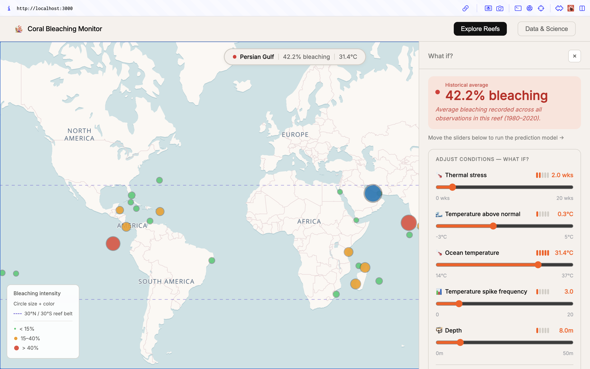

# 🪸 Coral Bleaching Monitor

Coral bleaching is one of the most visible consequences of ocean warming — but the data behind it is rarely accessible to non-scientists. This project turns 40 years of global observations into an interactive web app where anyone can explore how rising temperatures affect coral reefs around the world.

   



---

## What it does

Select a reef on the map, adjust environmental conditions with the sliders, and see the predicted bleaching outcome in real time — powered by a two-stage XGBoost model trained on 40 years of observations.

| Page              | Description                                                                                                           |
| ----------------- | --------------------------------------------------------------------------------------------------------------------- |
| 🌊 Explore Reefs  | Interactive world map + sliders to ask _what if_ — what happens if the ocean warms by 2°C? If thermal stress doubles? |
| 📊 Data & Science | 40 years of bleaching trends, the science behind thermal stress, and how the prediction model works.                  |

**Map features:**
- Vector tiles (CARTO Voyager via MapLibre GL) with customizable label font and size
- Reef markers sized and colored by average bleaching intensity
- 30°N / 30°S dashed parallels marking the tropical reef belt
- Hover tooltip with ecoregion stats; click to load reef conditions into the sliders

**Sliders:**
- SHAP-based impact dots show which variables matter most for the selected reef
- Historical context: shows how many real observations with similar stress conditions were recorded and their average bleaching

---

## Run locally

```bash
# From the project root — starts both API and frontend:
.venv/bin/python api/app.py & (cd client && npm start)
```

Open `http://localhost:3000`. The React app proxies all `/api/*` calls to Flask on port 5001.

---

## For the curious — how it's built

**Data:** 23,203 coral bleaching observations (1980–2020) across the Atlantic, Pacific, Indian Ocean, Red Sea, and Arabian Gulf, sourced from the [Global Coral Reef Monitoring Network](https://www.kaggle.com/datasets/mehrdat/coral-reef-global-bleaching).

**Model:** A two-stage XGBoost pipeline — first predicting whether bleaching occurs (classifier), then estimating severity (regressor). Trained on pre-2016 data, evaluated on 2016–2020. The strongest predictors are Degree Heating Weeks (DHW) and sea surface temperature anomaly (SSTA) — consistent with 40 years of marine biology research. SHAP values are computed at inference time to explain each prediction.

**Stack:** Flask API · React + Recharts + MapLibre GL · scikit-learn · XGBoost · SHAP

```
├── dev-notebooks/          # Data cleaning, EDA, model training
├── data/                   # Cleaned dataset (23,203 rows)
├── models/                 # Serialized XGBoost pipelines + SHAP explainers
├── api/                    # Flask REST API
└── client/                 # React frontend
```

---

_Built to make climate science accessible — you don't need to be a marine biologist to understand what's happening to coral reefs._
